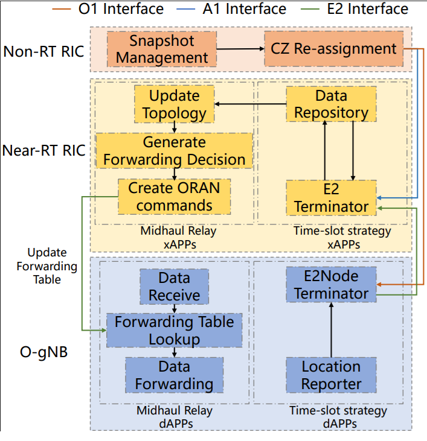

# SORA O-RAN Satellite Prototype on ns-3.42

[](https://www.nsnam.org/)
[](https://www.o-ran.org/)
[](https://github.com/FairyBlue/ns3-oran)

## Overview

This repository contains the ns-3.42-based prototype implementation used for our SORA study on O-RAN-assisted satellite network mobility management.

The prototype realizes a hierarchical control architecture with:

- 1 Non-RT RIC
- 2 Near-RT RICs
- 2 access clusters
- 3 O-DUs and 1 O-CU per cluster
- slot-level control orchestration over logical A1/O1 interactions and explicit E2 command delivery

The default scenario triggers a coordinated position swap and controller reassignment at `t = 8 s`:

- `DU2 <-> DU5`
- `DU3 <-> DU6`

This causes forwarding-table reconfiguration and a short transient service disruption that can be measured from the generated CSV outputs.

## Important Modeling Note

This is a satellite-inspired control/data-plane prototype, not a detailed satellite PHY/MAC simulator.

- The topology semantics are satellite-inspired:
  - Non-RT RIC: GEO-like global controller
  - Near-RT RICs: MEO-like regional controllers
  - O-DUs/O-CUs: lower-layer nodes
- Packet transport is intentionally abstracted through ns-3 IP links (`PointToPoint` and `CSMA`) with configured bandwidth and delay.
- A1 and O1 are modeled as logical control interactions with configurable delay.
- The E2 reporting/command path and node-side forwarding-table updates are explicitly executed through the instantiated E2 terminators and forwarding application.

So the repository is suitable for studying control decisions, reconfiguration timing, and signaling overhead at the prototype level, but it does not model waveform, fading, beam hopping, or other detailed satellite radio effects.

## Architecture



Figure 1 shows the logical architecture used in the prototype:

- `Non-RT RIC`: slot-level orchestration, snapshot/policy logic, CZ reassignment triggering
- `Near-RT RIC`: topology update, routing/forwarding decision generation, E2 command dispatch
- `O-gNB nodes`: reporting, forwarding-table lookup, and packet forwarding

In the current implementation:

- `A1/O1` are represented as logical control events with serialized payload accounting
- `E2` is represented through explicit report reception, command dispatch, and node-side command application
- forwarding-table updates happen inside `OranForwardingApp`

## Default Scenario

The main example is:

```bash
./ns3 run "scratch/oran-forwarding-example"
```

Default parameters:

- `simulationTime = 15 s`
- `swapTime = 8 s`
- `controlStartTime = 4 s`
- `slotDuration = 4 s`
- `nonRtProcessingDelay = 20 ms`
- `a1TransmissionDelay = 3 ms`
- `o1TransmissionDelay = 4 ms`
- `nearRtProcessingDelay = 15 ms`
- `routingProcessingDelay = 10 ms`
- `e2ReportTransmissionDelay = 10 ms`
- `e2CommandTransmissionDelay = 1 ms`
- `commandProcessingDelay = 2 ms`
- `enableTracing = true`

At `swapTime`, the prototype:

1. swaps the positions of `DU2/DU3` with `DU5/DU6`
2. records the topology-change event
3. clears the key next-hop entries on the relay nodes to emulate a transient reconfiguration gap
4. executes the slot-aligned control pipeline
5. applies new forwarding commands once the control loop completes

## Build and Run

From the repository root:

```bash
./ns3 configure --enable-examples --enable-tests
./ns3 build
./ns3 run "scratch/oran-forwarding-example"
```

To view all runtime parameters:

```bash
./ns3 run "scratch/oran-forwarding-example --help"
```

Example with tracing disabled:

```bash
./ns3 run "scratch/oran-forwarding-example --enableTracing=0"
```

## Output Files

After a run, the example generates throughput, control-overhead, and trace outputs.

### Throughput CSVs

- `du2_flow_throughput.csv`: DU2 path throughput (`DU2->DU3->CU1/CU2`)
- `du5_flow_throughput.csv`: DU5 path throughput (`DU5->DU6->CU2/CU1`)
- `du3_originated_flow_throughput.csv`: DU3-originated flow throughput (`DU3->CU1/CU2`)
- `du1_control_throughput.csv`: stationary control flow in cluster 1
- `du4_control_throughput.csv`: stationary control flow in cluster 2
- `cluster1_total_throughput.csv`: total throughput to `CU1`
- `cluster2_total_throughput.csv`: total throughput to `CU2`
- `cu1_received_throughput.csv`: receive-side throughput observed at `CU1`
- `cu2_received_throughput.csv`: receive-side throughput observed at `CU2`
- `cu_receive_validation.csv`: forwarded-vs-received throughput cross-check for both CUs

### Control and Reconfiguration Overhead CSVs

- `control_signaling_per_slot.csv`
  - per-slot counts for A1/O1/E2 events
  - forwarding-table update count
  - per-slot serialized control payload volume
  - controller-side processing totals and critical-path time
- `control_message_volume.csv`
  - per-message control records
  - interface, direction, message type, source, destination
  - serialized payload size in bytes
- `controller_processing_time.csv`
  - slot-level controller stage timings
  - Non-RT orchestration, Near-RT orchestration, and routing/xApp stages
- `reconfiguration_latency.csv`
  - trigger-to-forwarding-update completion time
  - intermediate timestamps for O1, E2-report, Near-RT, and E2-command stages
- `transient_throughput_impact.csv`
  - baseline throughput
  - minimum throughput during the disruption window
  - throughput drop ratio
  - recovery latency

### Additional Outputs

- `oran-forwarding-repository.db`: repository state stored by the O-RAN data layer
- `oran-forwarding-backbone-*.pcap`: abstract inter-RIC transport capture
- `oran-forwarding-cluster1-*.pcap`: abstract cluster-1 transport capture
- `oran-forwarding-cluster2-*.pcap`: abstract cluster-2 transport capture
- `oran-forwarding.tr`: ns-3 ASCII trace

## Code Map

The main files relevant to the prototype are:

- `scratch/oran-forwarding-example.cc`
  - scenario construction
  - slot scheduling
  - mobility/reconfiguration event
  - CSV export
- `contrib/oran/model/oran-forwarding-app.h`
- `contrib/oran/model/oran-forwarding-app.cc`
  - forwarding-table maintenance
  - command application delay
  - forwarding-table update trace hook
- `contrib/oran/model/oran-e2-node-terminator.h`
- `contrib/oran/model/oran-e2-node-terminator.cc`
  - report emission and node registration utilities
- `contrib/oran/model/oran-e2-node-terminator-wired.h`
- `contrib/oran/model/oran-e2-node-terminator-wired.cc`
  - node-side E2 terminator used by this prototype
  - forwards supported commands to the forwarding app
- `contrib/oran/model/oran-near-rt-ric-e2terminator.h`
- `contrib/oran/model/oran-near-rt-ric-e2terminator.cc`
  - report reception
  - E2 command dispatch
  - control-volume trace hooks
- `contrib/oran/model/oran-command.h`
- `contrib/oran/model/oran-command.cc`
  - base command support used by forwarding commands

## Control-Plane Overhead Instrumentation

The prototype now exposes five groups of metrics for the revision experiments:

1. `Control signaling events per slot`
   - A1 message count
   - O1 message count
   - E2 report count
   - E2 command count
   - forwarding-table update count
2. `Serialized control payload volume`
   - per-message and per-slot byte accounting
   - reported as serialized payload bytes, not full wire-level protocol bytes
3. `Reconfiguration latency`
   - from topology/CZ update trigger to forwarding-table update completion
4. `Transient throughput impact`
   - temporary throughput drop during reconfiguration
   - recovery latency relative to the steady-state baseline
5. `Controller-side processing time`
   - modeled processing delay inside Non-RT orchestration, Near-RT orchestration, and routing/xApp stages

## Notes on Terminology

Some class names inside `contrib/oran/model/` still contain the word `wired`, for example:

- `OranE2NodeTerminatorWired`

This is legacy module naming inherited from the ns-3 O-RAN codebase. In this prototype it should be read as a generic node-side E2 terminator over abstract transport links, not as a claim that the studied satellite scenario is literally a wired access network.

Likewise, the control-volume CSVs quantify serialized control payload volume in the prototype. They do not include full protocol-stack encapsulation overhead from a detailed satellite transport implementation.

## Typical Usage

Build and run:

```bash
./ns3 build
./ns3 run "scratch/oran-forwarding-example --enableTracing=0"
```

Inspect overhead outputs:

```bash
head -5 control_signaling_per_slot.csv
head -5 control_message_volume.csv
cat reconfiguration_latency.csv
cat transient_throughput_impact.csv
```

Inspect throughput outputs:

```bash
head -5 du2_flow_throughput.csv
head -5 du5_flow_throughput.csv
head -5 cluster1_total_throughput.csv
```

## Limitations

- no detailed satellite PHY/MAC or channel model
- no full packetized A1/O1 protocol stack
- control delays are modeled inside the simulator, not measured from wall-clock controller execution
- results are intended for prototype-level control and reconfiguration analysis

## License

This project is based on ns-3 and follows the licensing terms of the underlying ns-3 codebase and included O-RAN components.
